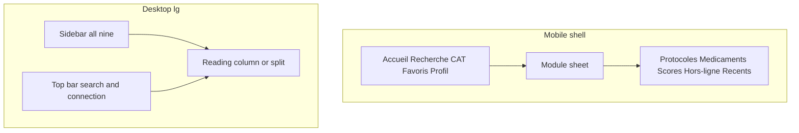

# Phase 3 — UX foundation

Doctor-facing information architecture and workflow specification for Nabda.

This document does not change visual design, the database, staff pack management, or medical-review workflows. It records the current doctor UX, the target information architecture, and the later implementation order. Where today’s components block the workflow, the required change is listed here and left for a later phase.

Status: specification only. No route, component, or schema change ships with this document.

## UX principles

1. A shift comes before a catalog. The first screen after open should offer a recent or frequent clinical item, not a tour.
2. Search is global. Every content type is reachable from Recherche without learning a private path.
3. One name per object. Navigation, docks, empty states, and toasts use the same French labels.
4. A visible control does a real thing, or it is not shown. “Bientôt disponible” is not a primary action.
5. Offline and Pro are statuses, not surprises. The doctor can see whether an item is free, Pro, online-only, downloaded, or stale before tapping download.
6. Calculators stay local. After the engine chunk loads, entering values does not call the network.
7. Desktop is a workstation. The phone column is not stretched to fill a wide screen.
8. Calm over novelty. Motivation is “reprendre” and “souvent utilisés”, not points, streaks, or badges.
9. No clinical authority the data does not have. Do not write “certifié” or “validé”.
10. The same routes exist on mobile and desktop. Only visibility and layout change.

## Primary personas and modes

These are usage priorities, not separate application modes and not separate accounts.

| Mode | When | What must be one or two taps away |
| --- | --- | --- |
| Garde | Emergency or night shift, often one hand, often weak network | Recent and frequent CAT, protocoles, médicaments, scores; downloaded packs |
| Consultation | Reading beside a patient | Protocol or drug section, calculator, related items, favoris |
| Learning | After the shift | Updates, saved items, deeper sections, sources |

Primary user: an Algerian doctor using Nabda repeatedly during and after hospital work.

Out of scope for this phase: staff editors, pack curators (`/internal/offline-packs`), and any medical-review or editorial workflow.

## Top user tasks

Design and later implementation order follow these tasks:

1. Search a drug by DCI, brand, or partial name.
2. Open a CAT quickly.
3. Open a protocole and jump to the relevant section.
4. Run a score and read the result immediately.
5. Download one item for offline use.
6. Open or update an offline pack.
7. Save an item to Favoris.
8. Resume a recently opened item.
9. Tell whether content is free, Pro, online-only, or available offline.

## Current information architecture

### What exists

Doctor routes today:

| Route | Screen | In bottom nav |
| --- | --- | --- |
| `/` | Onboarding and auth entry | No |
| `/home` | Dashboard | Accueil |
| `/search` | Global search | Recherche |
| `/cat`, `/cat/[slug]` | CAT index and detail | CAT |
| `/favorites` | Favoris | Favoris |
| `/profile` | Profil | Profil |
| `/protocols`, `/protocols/[slug]` | Protocoles | No |
| `/drugs`, `/drugs/[slug]` | Médicaments | No |
| `/calculators`, `/calculators/[slug]` | Scores | No |
| `/offline`, `/offline/view/[type]/[slug]` | Hors-ligne | No |
| `/history` | Historique | No; linked from Favoris footer |
| `/onboarding/personalisation` | Profile completion | No |
| `/auth/update-password` | Password | No |
| `/premium`, `/notifications`, `/interactions` | Empty modules | No, but linked from home, search, or profile |
| `/staging-access` | Staging gate | No |

Shell: `components/app/AppShell.tsx` centers content at `max-w-[430px]`. Many indexes and details use `max-w-[390px]`. `components/app/BottomNav.tsx` is Accueil, Recherche, CAT, Favoris, Profil. There is no desktop sidebar. Detail pages leave the shell and use their own header and bottom dock. Back is an explicit link, not `router.back()`.

`components/pwa/ConnectionIndicator.tsx` shows “En ligne” or “Hors-ligne” from `navigator.onLine` only.

### Current UX problems

**Navigation and findability**

- Protocoles, médicaments, scores, hors-ligne, and historique are easy to miss.
- Historique is only reached from the Favoris footer.
- Three competing hubs (home chips, search explore, CAT connected modules) point at the same catalogs.
- Protocole detail often returns to `/search?type=protocols` instead of `/protocols`.
- Drug and calculator indexes ignore `?category=`, so CAT “connected module” links do not filter.
- Header avatar and bottom Profil both open `/profile`.

**Desktop**

- Wide screens show the same phone column. No sidebar, no split view, no persistent search field.

**Dead or misleading actions**

- Home dictation and scan buttons have no handler.
- Search and CAT dictation/scan only toast “bientôt disponible”.
- `/premium`, `/notifications`, and `/interactions` render `EmptyModulePage` (“Module en préparation”) while home, search, and profile still link there.
- Protocol and CAT notes, “me prévenir”, and “suggérer” only set React state. Drug “Signaler” and indexation requests toast locally and do not persist.
- Medication result bookmarks do not call `toggleFavorite`.
- Profile Pro row “Mise en cache hors-ligne” says “Bientôt disponible” even though `/offline` works. Freemium sends that row to the empty `/premium` page.
- Search chip “Interactions” returns nothing. Home chip “Normes Bio” uses `?type=normes`, which falls back to all types.
- Protocol dock “Sources” can open `/cat/{slug}` or search, which is not the source list.
- CAT urgences uses the English label “Offline”.
- Urgency banner “SFMU 2024” is a design placeholder.

**Offline and Pro**

- Download exists on `/offline` for one item or a pack. Detail docks never expose it.
- Logged-out download returns without a sign-in explanation.
- Pro download failures are shown as generic connectivity or availability errors.
- Offline view runs calculators locally. CAT, protocole, and drug offline views are a title, a summary, and “Ouvrez-la en ligne pour la mise en page complète.”
- Favorite toggle fails silently when the user is signed out.

**Resume**

- `recordContentView` stores `item_type` and `item_slug` only. Reopening history does not restore `?section=` or `?tab=`.

**Terminology**

- Recommandations vs protocole.
- Scores vs calculateurs.
- Enregistrer (bookmark) vs Favoris.
- Hors-ligne vs Offline.

**States and accessibility**

- Many failures are toasts or `console.warn`, not a screen state.
- Root `loading.tsx` and `error.tsx` exist. Module routes do not have their own loading UI beyond that.
- Viewport zoom is disabled in `app/layout.tsx`.
- Several search fields rely on placeholder text only.
- Header controls are often under 44px.
- Detail titles are paragraphs, not headings, under a shell that is no longer present.

**Demo residue**

- Home and search can mix demo fixtures when content mode is demo.
- Glasgow and Cockcroft are special-cased even without a database row.
- Insight copy can claim offline Glasgow access without a download action.

Calculators already compute locally after lazy load (Glasgow, Cockcroft, additive points, generated formula). That stays. This phase does not add a network call on calculate.

## Proposed information architecture

One route map. Mobile and desktop show different subsets. They do not invent different destinations.

### Always visible

| Label | Route | Job |
| --- | --- | --- |
| Accueil | `/home` | Resume, frequent tools, module entry |
| Recherche | `/search` | Global find |
| CAT | `/cat` | Fastest clinical path |
| Favoris | `/favorites` | Saved items; segment Récents opens `/history` |
| Profil | `/profile` | Account, plan, preferences |

### Secondary, one gesture away

| Label | Route | Job |
| --- | --- | --- |
| Protocoles | `/protocols` | Recommendation index |
| Médicaments | `/drugs` | Drug index |
| Scores | `/calculators` | Calculator index |
| Hors-ligne | `/offline` | Packs, single items, local library |

### Active location

- The matching nav item sets `aria-current="page"`.
- A nested route highlights the parent: `/cat/[slug]` highlights CAT, `/drugs/[slug]` highlights Médicaments on desktop.
- Query strings do not change the active item.
- On mobile, a secondary route highlights no bottom-nav item. The module sheet shows the active secondary item instead.

### Global search

- Mobile: bottom-nav Recherche, plus the Accueil search field, plus a search icon on detail headers.
- Desktop: a search field fixed in the top bar. Submit goes to `/search?q=`. Shortcut `/` focuses it when focus is not in a field.
- Index pages may filter the current list. That control is labeled “Filtrer cette liste”. It is not a second global search.

### Retired until they do real work

Do not present these as working product destinations:

- `/premium` as an empty module. Plan status lives on Profil. A locked pack explains Pro on Hors-ligne and on the item.
- `/notifications`.
- `/interactions`.
- Dictation and scan.
- “Normes Bio”.

Profile’s Pro offline row should later link to `/offline`, not “Bientôt disponible”.

### Glossary

| Say | Do not say in navigation or docks | Note |
| --- | --- | --- |
| CAT | Arbres décisionnels, Mode garde as a module name | Index subtitle once: “Conduite à tenir” |
| Protocoles | Recommandations as the nav label | “Recommandation” only inside a document when that is the source type |
| Scores | Calculateurs as the nav label | “Calculateur” only on the tool screen |
| Favoris | Enregistrer for a bookmark | “Enregistrer” is reserved for a real note or account save |
| Hors-ligne | Offline | |
| Télécharger | Mettre en cache as the button | Status may still say “téléchargé” |
| Récents | Historique as a sixth tab | Route `/history` remains |

Confirmed product decisions for this spec:

- The visible heading “Recommandations” becomes “Protocoles”.
- Récents is a segment inside Favoris, not a sixth bottom-nav item.
- Mic, scan, notifications, and interactions stay hidden until they work.
- Full offline body rendering for CAT, protocole, and drug is a later phase. This spec defines the states and keeps the current summary fallback until that phase.

## Mobile navigation

Bottom navigation, shell routes only:

1. Accueil
2. Recherche
3. CAT
4. Favoris
5. Profil

Detail routes hide the bottom nav and show one sticky primary action (see screen specs).

Header on shell routes:

- Title of the current place.
- Connection status: “En ligne” or “Hors-ligne”.
- Modules button. Opens a sheet.

Module sheet, in this order:

- Protocoles
- Médicaments
- Scores
- Hors-ligne
- Récents

The sheet is also the way to reach those destinations from CAT, Favoris, or Profil without returning to Accueil.

Accueil still shows the same four modules (Protocoles, Médicaments, Scores, Hors-ligne) as a grid above the fold, so Garde does not depend on discovering the sheet.

Favoris segments: Favoris | Récents. Récents is `/history`.

Back on detail: an explicit “Retour” link to the parent index, or to the previous clinical item when the user came from a related-tool link. Do not rely on the browser back stack alone.

Bottom nav behavior:

- Stays visible on Accueil, Recherche, indexes, Favoris, Profil, and Hors-ligne.
- Hidden on onboarding, auth, and every detail route.
- Does not cover the sticky detail action.
- Active tab uses `aria-current` and a visible label weight change. Color is a later visual-system concern; the active state must not depend on color alone.

## Desktop navigation

From the `lg` breakpoint upward:

- Persistent left sidebar, about 15rem, with all nine destinations in this order: Accueil, Recherche, CAT, Protocoles, Médicaments, Scores, Favoris, Hors-ligne, Profil.
- A short divider between the five primary items and Protocoles, and another before Profil, so the groups stay readable. All nine remain visible. None are collapsed by default.
- Active item: `aria-current="page"` plus a persistent indicator that is not color-only (weight or a bar).
- Bottom nav is hidden.
- Top bar: search field, connection status, and the account link. Search is always visible.
- Content column sits in the remaining width. Reading width is capped near 42rem and is not stretched edge to edge. Calculators and protocoles use a split inside that workspace (see responsive rules).
- Sidebar does not scroll away. If the viewport is short, the sidebar scrolls independently.

## Golden user flows

Shared rule: every flow has a named loading, empty, error, offline, premium, and unavailable treatment. Spinners without text are not a state. Buttons that cannot run are hidden or disabled with a reason.

### Flow 1 — Search to clinical answer

Steps:

1. Open Recherche (tab, Accueil field, desktop top bar, or detail search icon).
2. Focus is in the field. Placeholder tells the doctor what can be typed.
3. Type a DCI, brand, partial name, CAT, protocole, or score name.
4. Optional: filter to one type (Tous, CAT, Protocoles, Médicaments, Scores).
5. Open one result.
6. Jump to a section, tab, or step.
7. Add to Favoris or Télécharger.

Primary action: open the matching result.

Secondary actions: filter type, favorite, download, clear query.

Interactions after the field is focused: type, then one tap to open. Filter is optional. Target is two interactions from a typed query to the open item.

| State | What the doctor sees |
| --- | --- |
| Loading | “Recherche en cours…” with the query kept. Not a blank page. |
| Empty | “Aucun résultat pour « {requête} ».” plus Effacer and pivots to the four indexes. No fake “suggest this protocole” action. |
| Error | “La recherche n’a pas abouti.” plus Réessayer. Previous results stay if any. |
| Offline | Search the downloaded library. Say “Résultats hors-ligne.” If the local index is empty, say so and link to Hors-ligne. |
| Premium | Results that exist but cannot be opened offline show “Pro requis” on the row. Online open still follows the entitlement already enforced by the server. |
| Unavailable | A result that 404s uses the content-unavailable screen for that type, with a link back to the index and to Recherche. |
| Success | The detail opens on the first clinical block, not on a marketing header. |

### Flow 2 — Garde

Steps:

1. Open the app on Accueil.
2. See Reprendre and Souvent utilisés before any upsell or profile completion.
3. Open a CAT, protocole, médicament, or score.
4. Use the decision path or the related score.
5. Return with Retour to the previous item when the link was related content; otherwise return to the parent index.

Primary action: open the recent or frequent item.

Secondary actions: search, open a module, download status.

Interactions: one tap from Accueil to the item when it is in Reprendre or Souvent utilisés.

| State | What the doctor sees |
| --- | --- |
| Loading | Skeleton or “Chargement de l’accueil…” that keeps the module grid visible. |
| Empty | New account: module grid plus “Vos consultations récentes apparaîtront ici.” No demo patients or demo drugs. |
| Error | “L’accueil n’a pas pu être mis à jour.” Modules and Recherche still work. |
| Offline | Reprendre lists downloaded items first and marks the others “En ligne uniquement”. |
| Premium | A Pro pack card links to Hors-ligne. It does not link to an empty premium page. |
| Unavailable | A stale shortcut opens the unavailable screen, then offers the index. |
| Success | The clinical item is on screen. Related score or drug is a secondary link, not a second home. |

### Flow 3 — Calculator

Steps:

1. Open a score from Scores, search, a related link, or Reprendre.
2. If the engine chunk is not loaded, show “Chargement du calcul…”.
3. Enter values with units visible on each input.
4. Result and interpretation update on the device. No API request after the engine is loaded.
5. Reset, copy the result, or add to Favoris.

Primary action: read the result.

Secondary actions: reset, copy, favorite, open a related CAT or protocole.

Interactions: open, type values. Result does not wait for a submit button when all required inputs are valid. Incomplete inputs show no fabricated number.

| State | What the doctor sees |
| --- | --- |
| Loading | Only while the engine chunk loads. |
| Empty | Required fields empty: no result number. Helper: “Renseignez les champs pour calculer.” |
| Error | Invalid value: inline “Valeur invalide” on that field. The previous valid result clears. |
| Offline | If the engine is cached, the form works and shows “Calcul local”. If the chunk is not cached: “Ce score n’est pas disponible hors-ligne.” |
| Premium | If the server entitlement blocks the tool, show “Pro requis” and do not render a sample result. |
| Unavailable | “Ce score n’est pas disponible.” Link to Scores. No fake result. |
| Success | Result, unit, and a short interpretation. Limitations sit under the result, before sources. |

Reset clears inputs and the result. Copy copies the result text only. Favoris saves the tool, not a specific numeric run.

### Flow 4 — Offline content

Steps:

1. On an item, read the availability line: Gratuit or Pro, then Non téléchargé, Téléchargé, Mise à jour disponible, or Non disponible hors-ligne.
2. Télécharger the item, or open Hors-ligne and Télécharger le pack.
3. Progress is visible: “Téléchargement… {n}/{total}” for a pack, “Téléchargement…” for an item. The control can be cancelled or left running without looking idle.
4. Open the item with the network off.
5. See version or freshness: “Téléchargé le {date}” and, when the server copy is newer, “Mise à jour disponible”.

Primary action: download, or open the local copy if it is already there.

Secondary actions: update, remove the local copy, open the online layout when online.

Interactions: one tap to start a download from the item. Pack download is one tap from the pack card.

| State | What the doctor sees |
| --- | --- |
| Loading | Progress text, not an indefinite spinner with no label. |
| Empty | Hors-ligne with nothing downloaded: “Aucun contenu téléchargé.” plus the available pack and item lists. |
| Error | “Le téléchargement a échoué. Réessayez.” The reason is specific when known (see state matrix). |
| Offline | Download buttons disabled with “Connexion requise pour télécharger.” Already downloaded items still open. |
| Premium | “Pro requis pour ce pack.” or “Pro requis pour cet élément.” No download starts. |
| Auth | “Connectez-vous pour télécharger.” Link to the auth entry. The button does not no-op. |
| Unavailable | “Ce contenu n’est pas disponible hors-ligne.” |
| Success | “Téléchargé.” The same control becomes Ouvrir or Mettre à jour. |

Calculator offline uses the local engine. CAT, protocole, and drug offline keep the current summary fallback until a later rendering phase, with the line “Version hors-ligne résumée. La mise en page complète est disponible en ligne.”

### Flow 5 — Resume work

Steps:

1. Open Accueil or Favoris → Récents.
2. Tap the item.
3. Land on that item.
4. If the current session still has `?section=` or `?tab=` in the URL, restore that place. Otherwise open the default clinical start (first key section, Carte, or calculator inputs).

Primary action: reopen the item.

Secondary actions: favorite, clear récents, filter by type.

Interactions: one tap.

Persisting the section in `user_history` needs a database change. This phase does not do that. Session restore is URL-only. A later phase may store the position.

| State | What the doctor sees |
| --- | --- |
| Loading | “Chargement des récents…” |
| Empty | “Aucune consultation récente.” Link to Recherche. |
| Error | “Les récents n’ont pas pu être chargés.” plus Réessayer. |
| Offline | Downloaded items open. Others show “En ligne uniquement” and do not pretend to open. |
| Premium | A Pro item the account cannot open shows “Pro requis” on the row. |
| Unavailable | “Ce contenu n’est plus disponible.” It can be removed from the list. |
| Success | The item opens. A session with a section query shows that section. |

## Screen responsibility matrix

Staff routes under `/internal` are unchanged and are not part of this matrix.

### Onboarding and auth entry — `/`

- Purpose: sign in or create an account.
- Primary user: first launch.
- Primary action: Commencer (create account) or Se connecter.
- Secondary: password reset path, staging is not shown here.
- Hierarchy: what Nabda is in one line, then the auth action. No clinical demo data.
- States: auth error inline; phone sign-in hidden until it works.
- Mobile: full-screen column, no bottom nav.
- Desktop: the same form in a centered card, not a phone frame on a wide empty page. Sidebar hidden.
- Offline: “Connexion impossible hors-ligne.” If a session exists, offer Accueil.
- Premium: none.
- Entry: app root, sign-out.
- Exit: `/home`, or personalisation only when the profile is incomplete.

### Accueil — `/home`

- Purpose: start a shift or resume work.
- Primary user: Garde, then Consultation.
- Primary action: open a recent or frequent item, or focus search.
- Secondary: module grid, connection status, plan hint.
- Hierarchy: greeting line, search, Reprendre, Souvent utilisés, module grid. Profile completion and Pro explanation sit below that.
- States: loading, empty récents, feed error, offline (downloaded first), Pro pack link.
- Mobile: bottom nav. Module grid visible without scrolling.
- Desktop: same blocks in the reading column. Search in the top bar may repeat the Accueil field; one of them is enough if the top bar is present. Prefer the top bar and do not show two equal search boxes.
- Offline: récents that are not downloaded are marked, not hidden.
- Premium: Pro status is a line, not a stub page.
- Entry: bottom nav, post-auth.
- Exit: search, any module, an item, Profil.

### Global search — `/search`

- Purpose: find any clinical item.
- Primary user: all modes.
- Primary action: open a result.
- Secondary: type filter, clear.
- Hierarchy: field, type chips, results. Zero state pivots to the four indexes.
- States: initial (no query: recent queries and type pivots, no demo fixtures), loading, results, empty, error, offline local results.
- Mobile: bottom nav. Field sticky under the header.
- Desktop: field may live in the top bar; the page shows filters and results at workspace width. Results are a list, not a stretched card stack.
- Offline: local library only, labeled.
- Premium: row badge, not a blocked page before search.
- Entry: nav, Accueil, detail search icon.
- Exit: detail, or an index pivot.

### CAT index — `/cat`

- Purpose: browse conduites à tenir.
- Primary user: Garde.
- Primary action: open a CAT.
- Secondary: filter this list, open Hors-ligne.
- Hierarchy: title “CAT”, subtitle “Conduite à tenir”, filter, list. No English “Offline” chip.
- States: loading, empty catalog, empty filter, error, offline (downloaded CAT marked).
- Mobile: bottom nav. List rows are the whole tap target.
- Desktop: list in the reading column. Filter stays visible beside or above the list.
- Offline: rows show téléchargé or en ligne uniquement.
- Premium: badge on the row when the item is Pro.
- Entry: bottom nav, module sheet, Accueil grid, search pivot.
- Exit: CAT detail, Recherche, Hors-ligne.

### Protocole index — `/protocols`

- Purpose: browse protocoles.
- Primary user: Consultation and Learning.
- Primary action: open a protocole.
- Secondary: filter this list.
- Hierarchy: title “Protocoles”, filter, list.
- States: loading, “Aucun protocole disponible”, “Aucun protocole ne correspond”, error, offline marks.
- Mobile: bottom nav, because this is a shell index.
- Desktop: sidebar highlights Protocoles. List uses the reading column.
- Offline / premium: same row rules as CAT.
- Entry: module sheet, Accueil grid, sidebar, search pivot.
- Exit: protocole detail.

### Médicament index — `/drugs`

- Purpose: browse drugs.
- Primary user: Consultation and Garde.
- Primary action: open a drug.
- Secondary: filter this list by class when class metadata exists. Ignore decorative category links that the page does not read.
- Hierarchy: title “Médicaments”, safety line if the product has one, filter, list. DCI is the primary label; brand is secondary.
- States: loading, empty catalog, empty filter, error.
- Mobile / desktop: same pattern as other indexes.
- Entry: module sheet, Accueil, sidebar, search.
- Exit: drug detail.

### Score index — `/calculators`

- Purpose: browse scores.
- Primary user: Garde and Consultation.
- Primary action: open a score.
- Secondary: filter this list.
- Hierarchy: title “Scores”, one-line safety note, filter, list.
- States: loading, empty, error. No sample scores presented as if they were the catalog.
- Entry: module sheet, Accueil, sidebar, related links, search.
- Exit: calculator detail.

### Protocole detail — `/protocols/[slug]`

- Purpose: read and jump.
- Primary user: Consultation.
- Primary action: jump to the relevant section.
- Secondary: Favoris, Télécharger, related score or drug.
- Hierarchy: see content hierarchy. Section list is how the doctor moves. Sources are last.
- States: loading, unavailable, draft (“Pas encore disponible”), error, offline summary or downloaded, Pro, stale.
- Mobile: no bottom nav. Sticky header with Retour, title, search. Sticky bar: Favoris and Télécharger. Section chips under the header.
- Desktop: section list sticky on the left of the text, inside the workspace. Actions in the header, not a fake phone dock.
- Offline: if not downloaded, “Non téléchargé” and a download action when allowed. If downloaded and the full renderer is not ready, summary fallback.
- Premium: “Pro requis” replaces download and, when the server withholds the body, replaces the body. No excerpt that pretends to be the protocole.
- Entry: index, search, récents, related link.
- Exit: index via Retour, related score or drug, Favoris.

### CAT detail — `/cat/[slug]`

- Purpose: decide quickly.
- Primary user: Garde.
- Primary action: follow the immediate path (Carte or first actions).
- Secondary: Étapes, warnings, related tools, Favoris, Télécharger.
- Hierarchy: see content hierarchy. Notes that do not persist are not a tab.
- States: loading, unavailable, draft, error, offline, Pro, stale.
- Mobile: no bottom nav. Path first. Warnings visible without a long scroll past identity chrome.
- Desktop: path in the main column. Related tools in a side panel, not under a long page.
- Offline / premium: same rules as protocole detail.
- Entry: CAT index, Accueil, search, related link.
- Exit: CAT index, related score or drug, the previous item when opened as related content.

### Drug detail — `/drugs/[slug]`

- Purpose: check safety and use.
- Primary user: Consultation.
- Primary action: read safety, then dosage.
- Secondary: Favoris, Télécharger, related protocole or score.
- Hierarchy: see content hierarchy.
- States: loading, unavailable, draft, error, offline, Pro. Remove “Signaler” until a report is stored.
- Mobile: tabs for safety, dosage, and related. Header sticky.
- Desktop: safety and dosage can sit in one column with a sticky in-page nav. No unused preparation mode on the public route.
- Entry: index, search, related link.
- Exit: drug index, related items.

### Calculator detail — `/calculators/[slug]`

- Purpose: compute locally.
- Primary user: Garde and Consultation.
- Primary action: read the instant result.
- Secondary: reset, copy, Favoris, related CAT.
- Hierarchy: see content hierarchy. Result stays on screen while inputs change.
- States: engine loading, incomplete inputs, invalid input, unavailable, offline without engine, Pro, no fabricated result.
- Mobile: inputs then result. Result sticks once computed if the form is long.
- Desktop: inputs and result side by side.
- Offline: works when the engine is cached.
- Entry: index, search, related link, Accueil.
- Exit: score index, related CAT or protocole.

### Favoris — `/favorites`

- Purpose: saved clinical items.
- Primary user: all modes, especially Learning and Consultation.
- Primary action: open a saved item.
- Secondary: filter by type, switch to Récents.
- Hierarchy: title “Favoris”, segments Favoris | Récents, type filter, list.
- States: loading, “Aucun favori.” with a link to Recherche, error, offline marks, Pro on the row.
- Mobile: bottom nav.
- Desktop: sidebar Favoris. List in the reading column.
- Entry: bottom nav, sidebar, success of Favoris on a detail.
- Exit: detail, Récents.

### Récents — `/history`

- Purpose: resume an item.
- Primary user: Garde and Consultation.
- Primary action: reopen an item.
- Secondary: filter by type, clear récents.
- Hierarchy: reached as the Récents segment. Privacy line stays short: récents are consultations of content, not a patient chart.
- States: see Flow 5.
- Mobile: bottom nav still shows Favoris as active.
- Desktop: Favoris remains the active sidebar item; the segment shows Récents.
- Entry: Favoris segment, Accueil “Reprendre” may deep-link here only as “Voir tout”.
- Exit: detail.

### Hors-ligne — `/offline`

- Purpose: download and open packs and items.
- Primary user: Garde before the shift, and any mode when the network drops.
- Primary action: download a pack or an item, or open a downloaded item.
- Secondary: update, see storage, local search of downloaded content.
- Hierarchy: connection and storage line, packs, individual items, downloaded library.
- States: loading catalog, empty library, download progress, download error, offline, Pro, auth required, storage full, stale, corrupted local file.
- Mobile: bottom nav. Pack card shows Gratuit or Pro before the button.
- Desktop: packs and library can sit in two columns inside the workspace.
- Entry: module sheet, Accueil grid, sidebar, detail download overflow (“Gérer les téléchargements”).
- Exit: offline content view, or the online detail when online.

### Offline content — `/offline/view/[type]/[slug]`

- Purpose: use a downloaded item without the network.
- Primary user: Garde.
- Primary action: read the local content or run the local calculator.
- Secondary: freshness, update when online, return to Hors-ligne.
- Hierarchy: title, freshness line, then calculator or summary body.
- States: missing local file, corrupted, stale, calculator engine missing.
- Mobile / desktop: same reading rules as the online detail, with the summary fallback until full offline render exists.
- Entry: Hors-ligne library, a downloaded row.
- Exit: Hors-ligne, or online detail when a connection exists.

### Profil — `/profile`

- Purpose: account, plan, and the few preferences that work.
- Primary user: all modes, infrequent.
- Primary action: see the plan and sign out.
- Secondary: password, open Hors-ligne, personalisation when incomplete.
- Hierarchy: identity, plan (Gratuit or Pro, and expiry when known), preferences that persist, account.
- States: loading profile, save error, signed-out guard.
- Hide rows that do nothing: language, display, support, and notification preferences, until they persist.
- Pro offline row: link to `/offline`, label “Contenus hors-ligne”.
- Mobile: bottom nav.
- Desktop: sidebar Profil. Form width stays narrow (about 32rem) inside the workspace.
- Offline: profile may be stale; say “Dernière synchro {date}” when that timestamp exists. Do not invent it.
- Premium: this is where expired Pro is explained. No empty `/premium` destination.
- Entry: nav, avatar.
- Exit: Hors-ligne, auth, Accueil.

## Content hierarchy rules

Order is the reading order. A doctor in a hurry should meet the decision before the provenance.

### Protocoles

1. Title.
2. Use case: who or which situation this protocole is for.
3. Key points: a short list, before long prose.
4. Main clinical sections, with a jump list.
5. Related scores and drugs.
6. Sources and supporting information.

Do not put editorial status, preparation essays, or local notes above the key points.

### CAT

1. Title.
2. Situation or context.
3. Immediate decision path.
4. Actions.
5. Warnings.
6. Related tools.

Warnings must be reachable without finishing the whole path. On a long carte, repeat a warning anchor near the top.

### Médicaments

1. DCI and presentation. Brand is secondary.
2. Main use.
3. Safety information.
4. Dosage-related content.
5. Contraindications and interactions.
6. Related protocoles and scores.

If interactions are not computed, say “Pas de vérification automatique des interactions.” Do not show a control that looks like a checker.

### Scores

1. Title.
2. What it measures, in one sentence.
3. Inputs and units.
4. Instant result.
5. Interpretation.
6. Limitations.
7. Favoris or copy.

The result is not below sources. Sources, when present, follow limitations.

## State matrix

Every major screen uses one of these treatments. “Major screen” means the matrix in the previous section, including indexes and details.

| State | Doctor-facing meaning | Required treatment |
| --- | --- | --- |
| Online | Network is available | Quiet “En ligne” in the header. Do not banner it. |
| Offline | Browser reports no network | “Hors-ligne” in the header. Downloaded items open. Others say “En ligne uniquement”. |
| Weak connection | Request is slow or failing intermittently | After a short wait, “Connexion lente.” Keep the last good content. Offer Réessayer. Do not replace the page with a spinner. |
| Syncing | A download or update is in progress | Named progress. The control shows it is working. |
| Update available | App shell or a downloaded item has a newer copy | App: “Nouvelle version de l’application” plus Mettre à jour. Item: “Mise à jour disponible” plus Mettre à jour. |
| Downloaded | A local copy exists | “Téléchargé” and the date. |
| Stale | Local copy is older than the server copy | “Mise à jour disponible”. The old copy still opens, with that label. |
| Not available offline | Item cannot be stored | “Non disponible hors-ligne.” No active download button. |
| Pro required | Entitlement blocks the pack, item, or body | “Pro requis”. Do not describe it as a network failure. |
| Authentication required | Action needs a session | “Connectez-vous pour continuer.” Link to auth. |
| Draft or unavailable | Content is missing or not published | “Pas encore disponible.” Link to the parent index. No fake body. |
| Empty results | Query or filter matches nothing | Name the query or filter. Offer Effacer. No invented popular items. |
| Request failure | Server or action failed | “Une erreur est survenue.” plus Réessayer. Keep prior content if it exists. |
| Corrupted local content | Indexed local payload cannot be read | “Ce fichier local est illisible.” Offer Supprimer la copie and, when online, Télécharger à nouveau. |
| Storage full | The device refused the write | “Espace insuffisant pour télécharger.” Do not leave a partial copy unmarked. |

Rules:

- No endless unlabeled spinner. Loading copy names the object.
- No empty screen without a sentence and a next action.
- No demo rows in production mode.
- A permission failure is not a generic offline error.
- A control that cannot run is hidden or disabled with the reason beside it.

Screen mapping in short:

- Indexes: online, offline marks, empty, error, Pro badge, unavailable row.
- Details: those, plus downloaded, stale, not available offline, auth on favorite or download, draft.
- Calculators: engine loading, local result, offline without engine, invalid input, Pro, unavailable. Never a fake number.
- Hors-ligne: all storage and download states, including corrupted and storage full.
- Accueil and Récents: empty, error, offline marks.
- Recherche: empty, error, offline local results.
- Profil: auth, plan, expired Pro, link to Hors-ligne.

## Responsive behavior

### Mobile

Visible immediately:

- Shell: header, connection, Modules, and the primary content start.
- Accueil: search, Reprendre or its empty line, module grid.
- Detail: title, availability, and the first clinical block.

Drawer or sheet:

- Module sheet for Protocoles, Médicaments, Scores, Hors-ligne, Récents.
- Auth sheets stay on the entry screen only.

Sticky:

- Header.
- Bottom nav on shell routes.
- Detail: header plus one action bar (Favoris and Télécharger, or the calculator result once present).
- Index filter chips under the header.

Back:

- Detail header “Retour” to the parent index, unless the user opened a related item, in which case Retour names the previous item (“Retour à la CAT”).

Bottom nav:

- Five items only.
- Hidden on detail, onboarding, and auth.
- Favoris stays active on `/history`.

Tables and long content:

- Tables become stacked label/value blocks.
- Wide figures scroll inside the article, not the whole app.
- Section jumps are chips, not a second page.

### Desktop (`lg` and up)

Sidebar:

- Always visible, nine items, independent scroll.
- Does not collapse to the phone tab set.

Content width:

- Workspace fills the space beside the sidebar.
- Prose caps near 42rem.
- Profil forms cap near 32rem.
- Do not center a 430px frame in a blank desktop page.

Split views:

- Score: inputs | result.
- Protocole: section list | section body.
- CAT: decision path | related tools.
- Hors-ligne: packs | downloaded library, when width allows.
- Drug: single column unless a safety summary is short enough to sit beside dosage. Default is one column with a sticky in-page nav.

Persistent controls:

- Top bar search.
- Connection status.
- Detail actions in the header (Favoris, Télécharger, Copier on a score).

Keyboard:

- `/` focuses search when not typing in a field.
- Escape closes the module sheet if one is open.
- Index lists are native links, so they take Enter.
- Calculator inputs use real labels, so Tab order follows the form. Result is an `aria-live="polite"` region.

Tables:

- Real tables may remain tables if they fit the reading column. Otherwise they use the stacked pattern. Horizontal scroll is inside the table region and is labeled.

Contextual panels:

- Related tools and sources are panels, not another full-screen route.
- They do not cover the decision path.

## Preliminary UX copy

French, functional, for Algerian doctors. Not brand lines. Do not use “certifié” or “validé”.

### Search

- Placeholder: “DCI, marque, CAT, protocole, score…”
- List filter label: “Filtrer cette liste”
- Loading: “Recherche en cours…”
- Initial: “Recherchez un médicament, une CAT, un protocole ou un score.”
- No results: “Aucun résultat pour « {requête} ».”
- Clear: “Effacer”
- Offline results: “Résultats hors-ligne”

### Download and packs

- Item: “Télécharger”
- Pack: “Télécharger le pack”
- Progress item: “Téléchargement…”
- Progress pack: “Téléchargement… {n}/{total}”
- Done: “Téléchargé”
- Update: “Mettre à jour”
- Manage: “Gérer les téléchargements”
- Pack free: “Gratuit”
- Pack pro: “Pro”
- Empty library: “Aucun contenu téléchargé.”
- Needs network: “Connexion requise pour télécharger.”

### Offline status

- Header online: “En ligne”
- Header offline: “Hors-ligne”
- Weak: “Connexion lente.”
- Row not local: “En ligne uniquement”
- Not storable: “Non disponible hors-ligne.”
- Freshness: “Téléchargé le {date}”
- Stale: “Mise à jour disponible”
- Summary fallback: “Version hors-ligne résumée. La mise en page complète est disponible en ligne.”
- Local calculator: “Calcul local”
- Engine missing: “Ce score n’est pas disponible hors-ligne.”

### Premium and account

- Lock: “Pro requis”
- Pack lock: “Pro requis pour ce pack.”
- Item lock: “Pro requis pour cet élément.”
- Expired: “Votre accès Pro a expiré.”
- Expired next step: “Les contenus Pro ne sont plus téléchargeables. Les copies déjà téléchargées restent ouvrables.”
- Sign in: “Connectez-vous pour télécharger.”
- Sign in favorite: “Connectez-vous pour ajouter aux favoris.”

### Unavailable, empty, errors

- Missing CAT: “Cette CAT n’est pas disponible.”
- Missing protocole: “Ce protocole n’est pas disponible.”
- Missing drug: “Ce médicament n’est pas disponible.”
- Missing score: “Ce score n’est pas disponible.”
- Draft: “Pas encore disponible.”
- Empty favoris: “Aucun favori.”
- Empty récents: “Aucune consultation récente.”
- Empty accueil récents: “Vos consultations récentes apparaîtront ici.”
- Generic failure: “Une erreur est survenue.”
- Retry: “Réessayer”
- Search failure: “La recherche n’a pas abouti.”
- Home failure: “L’accueil n’a pas pu être mis à jour.”
- Download failure: “Le téléchargement a échoué. Réessayez.”
- Corrupt: “Ce fichier local est illisible.”
- Storage: “Espace insuffisant pour télécharger.”
- Remove local: “Supprimer la copie”
- Download again: “Télécharger à nouveau”

### Calculators

- Loading engine: “Chargement du calcul…”
- Need inputs: “Renseignez les champs pour calculer.”
- Invalid: “Valeur invalide”
- Limitations heading: “Limites”
- Reset: “Réinitialiser”
- Copy: “Copier le résultat”
- No checker on drugs: “Pas de vérification automatique des interactions.”

### Favoris

- Add: “Ajouter aux favoris”
- Added: “Ajouté aux favoris”
- Remove: “Retirer des favoris”

### Navigation labels

Accueil, Recherche, CAT, Favoris, Profil, Protocoles, Médicaments, Scores, Hors-ligne, Récents, Modules, Retour.

## Usability risks

1. Hiding interactions and notifications will remove current links. Those links go to empty pages today, so the removal matches what the product can do. Confirm before implementation that no launch message depends on the bell.
2. Renaming “Recommandations” to “Protocoles” may surprise anyone trained on the old heading. The index subtitle can say “Protocoles et recommandations” once if content mixes both source types.
3. Session-only section restore will feel incomplete to doctors who expect Récents to reopen the same section tomorrow. Say that clearly in implementation notes. Do not fake it.
4. Offline summaries for CAT, protocoles, and drugs can disappoint during a garde. The freshness line must not imply a full fiche.
5. A module sheet plus an Accueil grid can duplicate entry points. Both stay, because Garde should not depend on finding Modules. Labels must match exactly.
6. Desktop split views need a real breakpoint. Implementing them by widening the 430px frame would fail the acceptance criteria.
7. Removing demo fixtures from production paths is required. Preview query params for staff must stay off doctor navigation.
8. Silent favorite failure when signed out is a trust problem. The auth line is mandatory.
9. Zoom is disabled in the viewport. Restoring pinch-zoom is an accessibility fix for a later implementation phase, not a visual redesign.
10. Calculator special cases (Glasgow, Cockcroft) must keep local compute when the catalog row is absent. The spec does not remove those engines.

## Recommended implementation order

Do not start this order in the current change. It is the sequence for later phases.

1. Shell structure only: desktop sidebar, mobile module sheet, hide bottom nav on detail, same routes. No palette or type redesign.
2. Remove or hide dead actions and align labels (glossary). Point the Pro offline row to `/offline`. Stop linking to empty `/premium`, `/notifications`, and `/interactions`.
3. Search filters limited to Tous, CAT, Protocoles, Médicaments, Scores. Remove Interactions and Normes Bio from the doctor UI.
4. Detail actions: Favoris that calls `toggleFavorite`, Télécharger, section jump. Remove non-persisting notes, notify, suggest, and Signaler.
5. Accueil: Reprendre and Souvent utilisés above upsell and profile completion. No demo rows in production.
6. Offline and Pro copy, including signed-out download and distinct Pro errors.
7. Calculator: shared reset, copy, and favorite; result region; no network on calculate.
8. Desktop reading column and splits for scores, protocoles, and CAT.
9. Session section restore through the existing URL only. Do not alter `user_history`.

Explicitly later, and not part of that sequence until product confirms them:

- Full offline render of CAT, protocole, and drug bodies.
- Persisting section position (requires a database change).
- Visual design system: color, type, motion, illustration.
- Medical review or editorial workflow.
- Staff pack-management redesign.
- Dictation, scan, notifications, interaction checker.

## Acceptance criteria

The UX plan is accepted when all of the following are true of this specification:

- A doctor can see a path to CAT, Protocoles, Médicaments, Scores, Favoris, and Hors-ligne.
- Search is global on mobile and desktop.
- Desktop is specified as a sidebar workspace, not a wider phone frame.
- CAT, protocole, drug, and score workflows are distinct in hierarchy and primary action.
- Offline and Pro states are named and are not disguised as network errors.
- Every major route has an intentional loading, empty, error, and offline treatment.
- Calculator flow stays instant and local after engine load.
- The doctor can download one item or a curated pack.
- Primary flows do not depend on demo values.
- No visible action is specified as non-functional.
- Navigation supports Garde, Consultation, and Learning without separate mode switches.
- A later visual pass can apply a design system on top of this structure without moving responsibilities again.

## Files and boundaries

This phase adds only:

- `docs/ux/phase-3-ux-foundation.md`

Intentionally unchanged:

- All `app/` routes and `components/` implementations.
- Database schema and `user_history`.
- `components/internal/offline-packs/` and other staff UI.
- Entitlement logic and calculator engines, beyond the behavior this spec requires them to keep.

## Open product decisions

These are the defaults this spec adopts. Change the spec before implementation if a default is wrong.

1. Navigation and the protocole index heading say “Protocoles”, not “Recommandations”.
2. Récents is a Favoris segment, not a sixth bottom-nav item.
3. Mic, scan, notifications, and interactions stay out of the doctor UI until they perform a real action.
4. Full offline rendering of CAT, protocole, and drug bodies waits for a later phase. The summary fallback remains, with honest copy.
5. Section position is not written to the database in the UX implementation that follows this spec.
